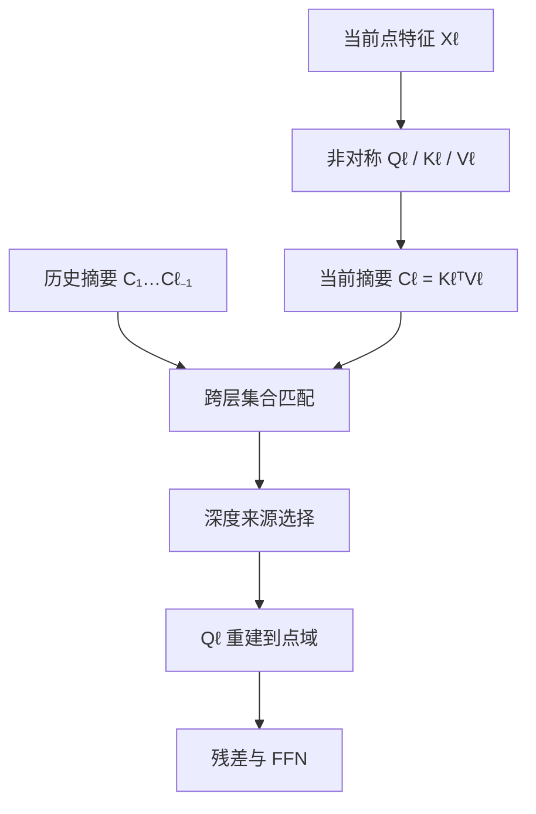

# you asked

message time: 2026-09-16 21:54:09

我现在有个新的想法，前面我对lrsa进行了CDPA和后续的KCDNO式的改造，但其实LRSA并没有证明器不需要层内注意力，甚至在论文中还比较了层内注意力和mlp发现层内注意力优于mlp，但transolver到linearno的改造则说明了transolver的构造并不需要层内注意力，所以我的想法是这次将linearno换成用于修改的基础模型，而不是lrsa，所以你首先要回答一个问题，仔细观察linearno和transolver的仓库，它们对数据集的要求是否一致，我在复现，改造transolver这个项目时已经按照transolver仓库的要求将数据下载好并也成功训练，现在如果要改造linearno的构造可不可以直接clone linearno的仓库，然后在它的基础上进行改造，可不可以直接用transolver下载和处理后的数据，注意要比较两者的仓库的相关部分再回答。还是说还是应该再transolver仓库的基础上（因为原来的仓库已经改造出了CDLNO和KCDNO两个模型，所以已经有了CDPA和前面的面向历史所有block的核化注意力层，会不会直接在此基础上让codex参考linearno的仓库然后改造出linearno再加入上面的机制会更好改些），注意关键还是该处来的模型的质量最重要，总额和考虑告诉我应该基于哪个仓库完成改造

---

# chatgpt response

这个判断不能只看论文中的数据集名称；即使两边都写 Darcy、Airfoil、Pipe，它们也可能在目录名、归一化、张量轴、时间窗口、采样索引和模型调用接口上不兼容。我会分别核对两个官方仓库的数据加载器、任务入口、预处理和模型 wrapper，再从“数据能否直接复用”和“哪一个基座更不容易损害新模型质量”两个层面给出结论。

两个官方仓库的源码副本已经在当前工作区中，因此我可以直接做文件级对照，而不只依赖 README。接下来重点核对六个标准 PDE、AirfRANS、ShapeNet-Car 三类入口，以及它们是否只是“模型模块不同”还是连数据流水线也发生了变化。

数据层的结论已经比较清楚：六个标准 PDE、AirfRANS 和 ShapeNet-Car 的底层数据格式基本兼容，但 LinearNO 仓库并不是“把 Transolver 模型文件换掉即可”的干净复刻，其中存在若干路径、调试默认值和任务实现分叉。现在我再核对模型接口与依赖差异，然后给出明确的基座选择。

结论很明确：

> **研究基线改成 LinearNO，但工程基座继续使用你现在的 Transolver→CDLNO/KCDNO 仓库。**  
> 官方 LinearNO 仓库应作为“论文实现参考与数值对照仓库”，不建议作为新项目的主仓库。

这样既能真正研究“LinearNO＋跨层机制”，又能最大限度保证数据、训练协议、已有 CDPA/KCDNO 模块和运行环境不被破坏。

## 一、Transolver 下载的数据能否直接用于 LinearNO？

总体答案是：

> **数据内容可以直接复用，不需要重新下载或重新预处理；但不能保证克隆 LinearNO 后不改路径就能运行。**

LinearNO 官方论文明确说明，其 encoder、decoder 沿用 Transolver 的整体设计，实验也覆盖相同的六个标准 PDE、AirfRANS 和 ShapeNet-Car。[LinearNO 论文](https://arxiv.org/html/2511.06294v3)、[LinearNO 官方仓库](https://github.com/HiPRL/LinearNO)、[Transolver 官方仓库](https://github.com/thuml/Transolver)

我按当前官方代码检查得到以下结果。

| 数据集        |                    底层文件是否兼容 | 能否复用现有数据 | 需要注意的问题                              |
| ------------- | ----------------------------------: | ---------------: | ------------------------------------------- |
| Darcy         | 相同 `.mat` 文件和 `coeff/sol` 字段 |             可以 | 修改 `data_path` 即可                       |
| Elasticity    |                    相同 `.npy` 文件 |             可以 | 划分和归一化逻辑基本一致                    |
| Airfoil       |                    相同 `X/Y/Q.npy` |             可以 | 目录路径需对应                              |
| Pipe          |               相同 `Pipe_X/Y/Q.npy` |             可以 | Transolver 先截取 1200 样本；标准数据上等价 |
| Navier–Stokes |             相同 `.mat` 和 `u` 字段 |             可以 | 两仓库拼接文件路径的方式不同                |
| Plasticity    |            相同 `input/output` 字段 |             可以 | LinearNO 的文件名拼接存在扩展名问题         |
| AirfRANS      |                     loader 基本一致 |     可以直接复用 | LinearNO 默认启用 debug，只取两个训练样本   |
| ShapeNet-Car  |             loader 和预处理数组一致 |     可以直接复用 | LinearNO 命令行参数类型有明显问题           |

### 1. 六个标准 PDE

两边使用的是同一批文件和基本相同的张量处理：

- Darcy：`piececonst_r421_N1024_smooth1.mat`、`smooth2.mat`
- Elasticity：`Random_UnitCell_sigma_10.npy`、`Random_UnitCell_XY_10.npy`
- Airfoil：`NACA_Cylinder_X.npy/Y.npy/Q.npy`
- Pipe：`Pipe_X.npy/Y.npy/Q.npy`
- NS：`NavierStokes_V1e-5_N1200_T20.mat`
- Plasticity：`plas_N987_T20.mat`

因此你已经下载的 Transolver 数据无需重新下载。

但有两个明确的路径例外：

- LinearNO 的 NS 入口自动在 `data_path` 后拼接文件名，因此应让路径指向包含该文件的目录，而不是照搬 Transolver 的上一级目录。[LinearNO NS 入口](https://github.com/HiPRL/LinearNO/blob/main/Standard_PDE_Benchmark/exp_ns.py#L28-L40)
- LinearNO 的 Plasticity 代码拼接的是 `"/plas_N987_T20"`，没有 `.mat`，与常见下载文件名不完全一致。[LinearNO Plasticity 入口](https://github.com/HiPRL/LinearNO/blob/main/Standard_PDE_Benchmark/exp_plas.py#L93-L111)

所以是“文件兼容”，不是“所有路径参数完全兼容”。

### 2. AirfRANS

LinearNO 和 Transolver 的 AirfRANS 数据集类在实质计算上相同：

- 都读取 `manifest.json`
- 都使用相同的原始字段
- 都进行相同的采样、归一化和图数据封装

可对照 [LinearNO AirfRANS loader](https://github.com/HiPRL/LinearNO/blob/main/AirfRANS/dataset/dataset.py) 与 [Transolver AirfRANS loader](https://github.com/thuml/Transolver/blob/main/Airfoil-Design-AirfRANS/dataset/dataset.py)。

但 LinearNO 的主程序默认：

```python
--debug 1
```

随后只保留两个训练样本和一个验证样本。若直接运行而没有显式设置 `--debug 0`，实验会严重失真。[LinearNO AirfRANS main.py](https://github.com/HiPRL/LinearNO/blob/main/AirfRANS/main.py#L27-L43)

### 3. ShapeNet-Car

两边都使用相同的：

```text
x.npy
y.npy
pos.npy
surf.npy
```

训练/验证 fold、图数据封装和归一化方式也基本相同。可对照 [LinearNO ShapeNet-Car loader](https://github.com/HiPRL/LinearNO/tree/main/ShapeNetCar/dataset) 和 [Transolver ShapeNet-Car loader](https://github.com/thuml/Transolver/tree/main/Car-Design-ShapeNetCar/dataset)。

但 LinearNO 把：

```python
batch_size
nb_epochs
```

声明成了 `float`。一旦从命令行显式传值，便可能传给 `DataLoader` 或 `range` 一个浮点数。[LinearNO ShapeNet-Car main.py](https://github.com/HiPRL/LinearNO/blob/main/ShapeNetCar/main.py#L15-L27)

因此，现有数据可以复用，但不建议把官方入口脚本当作无需检查的成熟流水线。

---

## 二、为什么不推荐直接以 LinearNO 官方仓库为主仓库？

### 1. 官方 LinearNO 仓库不是完全统一的实现

LinearNO 在三个任务目录中维护了三份不同的核心实现：

| 目录         | 低秩维度定义           | 温度参数      | 输出映射                  |
| ------------ | ---------------------- | ------------- | ------------------------- |
| Standard PDE | `key_ratio`            | 部分变体不同  | 常含 `Linear-GELU-Linear` |
| AirfRANS     | `slice_num`            | 实现方式不同  | 较简单的线性输出          |
| ShapeNet-Car | `key_ratio × dim_head` | 独立 Q/K 温度 | `Linear-GELU-Linear`      |

代码可分别见：

- [Standard PDE LinearNO](https://github.com/HiPRL/LinearNO/blob/main/Standard_PDE_Benchmark/model/LinearAttnNeuralOperator.py)
- [AirfRANS LinearNO](https://github.com/HiPRL/LinearNO/blob/main/AirfRANS/models/LinearAttnNeuralOperator.py)
- [ShapeNet-Car LinearNO](https://github.com/HiPRL/LinearNO/blob/main/ShapeNetCar/models/LinearAttnNeuralOperator.py)

这意味着不能简单复制某一份 `LinearAttnNeuralOperator.py`，然后宣称它是适用于所有任务的唯一 LinearNO 实现。更合理的做法是：

- 依据论文建立一个统一、可测试的 LinearNO 核心；
- 将规则网格卷积、非规则点输入和 ShapeNet 几何输入作为任务 wrapper；
- 明确记录不同任务使用的低秩维度与温度设置。

### 2. 官方运行脚本存在容易污染实验的设置

除前述 debug、参数类型和路径问题外，官方标准 PDE 的 `LinearNO_*.sh` 多数默认传入：

```bash
--eval 1
```

即脚本名虽然像训练脚本，实际更接近加载模型评估。[LinearNO Darcy 脚本](https://github.com/HiPRL/LinearNO/blob/main/Standard_PDE_Benchmark/scripts/LinearNO_Darcy.sh)

这不代表 LinearNO 方法有问题，但说明它不适合未经审计就作为长期研究工程基座。

### 3. 官方环境与你现有环境不一致

LinearNO 官方环境锁定的核心版本是：

```text
PyTorch 2.4.0
CUDA 11.8
torchvision 0.19.0
PyG 扩展 cu118
```

见 [LinearNO environment.yml](https://github.com/HiPRL/LinearNO/blob/main/environment.yml#L278-L324)。

而你现在已经稳定使用：

```text
PyTorch 2.11
CUDA 12.8
PyG / pyg-lib cu128
```

LinearNO 的核心算子只是普通 PyTorch 线性层、softmax 和 `einsum`，本身没有理由必须退回 Torch 2.4。因此，为它另建旧环境反而会增加环境差异和 PyG 冲突风险。

---

## 三、为什么继续使用当前 Transolver/CDLNO/KCDNO 仓库更有利于模型质量？

这里需要区分两个概念：

- **方法基线：换成 LinearNO**
- **代码与实验基座：保留当前 Transolver 派生仓库**

推荐后者主要不是为了少写代码，而是为了控制实验变量。

### 1. 数据与训练协议已经验证

你的当前仓库已经在实际下载的数据上成功训练过。继续使用原有：

- 数据划分；
- 归一化；
- batch 组织；
- loss；
- scheduler；
- rollout；
- 评价指标；
- checkpoint；
- AirfRANS 和 ShapeNet-Car wrapper；

可以保证 LinearNO、LinearNO＋CDPA、LinearNO＋核化跨层机制与 Transolver 在同一流水线上比较。

否则，如果换到 LinearNO 官方仓库后结果变化，你无法确定原因是：

- 模型架构；
- 数据划分；
- batch size；
- debug 模式；
- scheduler；
- 路径读取错误；
- 还是官方三个任务实现不一致。

### 2. LinearNO 本来就是从 Transolver 架构变换而来

论文明确说明 LinearNO 保留 Transolver 的整体 encoder/decoder，只重构 Physics-Attention：

$$
Q_l=\operatorname{softmax}_{R}(X_lW_l^Q),\qquad
K_l=\operatorname{softmax}_{N}(X_lW_l^K),
$$

$$
S_l=K_l^\top V_l,\qquad
Y_l=Q_lS_l.
$$

因此，把 Transolver 仓库中的 `PhysicsAttention` 替换为论文一致的 LinearNO 核心，在架构上是自然的，不会因为没有使用 LinearNO 官方工程框架而降低模型质量。

### 3. 已有 CDPA/KCDNO 可以保留为独立模块

你已经在当前仓库中实现了：

- CDLNO；
- CDPA；
- KCDNO；
- 层内 attention/FFN 消融；
- 核化历史访问；
- 相应配置和任务入口。

若重新以 LinearNO 仓库开始，需要把这些机制重新迁移一次，还要重新解决模型注册、配置、张量接口和任务 wrapper 问题。重复迁移不仅耗时，也容易使两代实验实现细节不一致。

---

## 四、但现有 CDPA/KCDNO 不能直接无脑接到 LinearNO 上

这是影响模型质量的最关键提醒。

LRSA 中存在显式 learned-query latent：

$$
T_l\in\mathbb R^{B\times M\times d}.
$$

你原来的 CDPA/KCDNO 可以把不同深度的 $T_l$ 当作历史 latent。

但 LinearNO 的低秩中间表示是：

$$
S_l=K_l^\top V_l
\in\mathbb R^{B\times H\times R\times d_h}.
$$

它不是 LRSA 那种由固定 learned queries 产生的 latent token，而是由当前层的 $W_l^K$ 动态构造的低秩统计量。因此：

1. LinearNO 各层的第 $r$ 个低秩槽位不一定天然对齐；
2. 旧 CDPA 如果默认“同一 latent 位置跨层语义一致”，不能直接套用；
3. 核化历史访问应当读取 $S_1,\ldots,S_{l-1}$，或者读取经共享投影对齐后的历史表示；
4. 必须明确是否共享 Q/K 的低秩基、使用层间 adapter，或者通过 cross-attention 动态对齐。

换句话说：

> 现有仓库可以复用 CDPA/KCDNO 的工程框架、缓存和融合逻辑，但历史表示的定义和对齐方式必须针对 LinearNO 重新设计。

这也是为什么“继续当前仓库”不等于“把 LRSA 类名改成 LinearNO”。

---

## 五、还需要修正一个理论表述

LinearNO 的结果支持的是：

> Transolver 的 **slice-to-slice self-attention** 并非必要，在将压缩与重建推广为非对称 $Q/K$ 后，去掉这部分反而常常更好。

它并没有证明“任何层内 token 混合都可以完全删除”。

LinearNO 仍然通过

$$
K_l^\top V_l
$$

把所有 $N$ 个输入点汇聚成输入相关的全局低秩统计量，再通过

$$
Q_l(K_l^\top V_l)
$$

把这些统计量写回每个点。因此它依然具有全局、输入相关的 token mixing，只是没有显式计算低秩 token 之间的 self-attention。

这与之前在 LRSA 中做：

```text
压缩 → Identity → 重建
```

并不完全等价。你现在改用 LinearNO 作为研究基础，在原理上确实比“直接删除 LRSA latent SA”更合理。

---

## 六、最终建议

采用“双仓库角色”，但只在一个仓库里正式开发：

| 仓库                             | 角色                               |
| -------------------------------- | ---------------------------------- |
| 当前 Transolver→CDLNO/KCDNO 仓库 | 主开发、训练和最终论文实验仓库     |
| 官方 LinearNO 仓库               | 只读参考、公式核对和数值一致性对照 |

在当前仓库中应保留四类互不干扰的模型：

```text
Transolver                    原始基线
LinearNO                      论文一致的新基线
CDLNO / KCDNO                 原有 LRSA 系列研究
LinearNO-CDPA / LinearNO-KH   新的 LinearNO 跨层系列
```

尤其要先建立一个不带 CDPA/KCDNO 的纯 LinearNO 基线，并确保：

- 与官方核心公式逐项一致；
- 能复制权重后在随机张量上得到相同输出；
- 使用现有 Transolver 数据入口正常训练；
- 不修改任何已有 CDLNO/KCDNO 行为；
- 再在其上增加跨层机制。

因此最终判断是：

> **不用重新下载数据，也不建议换掉现有主仓库。最稳妥且最有利于模型质量的方案，是在当前已验证的 Transolver 派生仓库中新增论文一致的 LinearNO 模型族，再针对 LinearNO 的 $K^\top V$ 低秩表示重新定义 CDPA/KCDNO 的跨层连接。官方 LinearNO 仓库只作为参考和对照，不作为直接继续开发的基座。**

---

# you asked

message time: 2026-09-16 22:09:38

你说“”CDPA 如果默认“同一 latent 位置跨层语义一致”，不能直接套用 “但请你再仔细审查一下我原来的CDPA机制，其中应该做了两个层级的softmax应该是没有默认相同位置的latent token 是对齐的，因为当前层的一个token对其中一个历史层的所有latent token（不妨假设一层有64个）都做了attention(通过softmax计算了权重)，所以CDPA应该是无需对齐的

---

# chatgpt response

你这个质疑是成立的。我前一句把“跨层表示需要可比较”误写成了“同一 latent 索引需要对齐”；这两者不是一回事。我会按你原来 CDPA 的两级 softmax 重新逐步核对，并明确它迁移到 LinearNO 时真正需要解决的兼容性是什么。

你是对的。原 CDPA 本身就是“先通过 Cross-Attention 动态对齐，再进行跨深度融合”，并不要求不同层中相同索引的 latent token 语义一致。我前面将“特征空间需要可投影比较”误写成了“latent 位置需要对齐”，这个判断应当修正。

## 1. CDPA 的两级 softmax

设当前 latent 为

$$
Z\in\mathbb{R}^{B\times M_q\times d},
$$

第 $s$ 个历史 latent 为

$$
T_s\in\mathbb{R}^{B\times M_s\times d}.
$$

原 CDLNO 中通常 $M_q=M_s=64$，但数学上不要求二者相等。

### 第一级：历史内部的 token softmax

当前状态产生 Query：

$$
Q=\operatorname{LN}_q(Z)W_Q.
$$

每份历史分别产生 Key 和 Value：

$$
K_s=\operatorname{LN}_{kv}(T_s)W_K,\qquad
V_s=\operatorname{LN}_{kv}(T_s)W_V.
$$

对第 $m$ 个当前 token，它会查询第 $s$ 份历史中的所有 $M_s$ 个 token：

$$
A_{s,m,n}
=
\operatorname{softmax}_{n}
\left(
\frac{Q_mK_{s,n}^{\top}}{\sqrt{d_h}}
\right).
$$

然后得到：

$$
R_{s,m}
=
\sum_{n=1}^{M_s}A_{s,m,n}V_{s,n}.
$$

所以如果每层有 64 个 latent token，那么当前的第 $m$ 个 token 并不是只读取历史的第 $m$ 个 token，而是：

$$
Z_m\longrightarrow
\{T_{s,1},T_{s,2},\ldots,T_{s,64}\}.
$$

这一级 softmax 已经完成了跨层 token 的内容匹配。

### 第二级：历史来源之间的 softmax

第一阶段得到：

$$
R_1,R_2,\ldots,R_S\in\mathbb{R}^{B\times M_q\times d}.
$$

此时所有 $R_s[:,m,:]$ 都以同一个当前 Query $Z[:,m,:]$ 为锚点：

- $R_1[:,m,:]$：当前 token $m$ 从历史层 1 读取的结果；
- $R_2[:,m,:]$：当前 token $m$ 从历史层 2 读取的结果；
- $R_S[:,m,:]$：当前 token $m$ 从历史层 $S$ 读取的结果。

再加入恒等候选：

$$
R_0=Z.
$$

对每个当前 token 分别计算来源分数：

$$
e_{b,m,s}
=
w^\top\operatorname{RMSNorm}(R_{s,b,m}),
$$

并沿历史来源轴做第二次 softmax：

$$
\alpha_{b,m,s}
=
\operatorname{softmax}_{s}(e_{b,m,s}).
$$

最终：

$$
\widetilde Z_{b,m}
=
\sum_{s=0}^{S}\alpha_{b,m,s}R_{s,b,m}.
$$

因此两个 softmax 的职责分别是：

| softmax | 归一化轴              | 作用                                       |
| ------- | --------------------- | ------------------------------------------ |
| 第一级  | 每份历史中的 token 轴 | 当前 token 从该历史的所有 token 中检索信息 |
| 第二级  | 历史来源轴            | 当前 token 决定更依赖哪一层历史            |

所以你的概括完全正确：

> CDPA 不要求 $Z_m$、$T_{1,m}$、$T_{2,m}$ 表示相同物理区域，因为第一级 Cross-Attention 已经把每份历史动态映射到了当前 Query 的坐标系中。

## 2. 一个具体张量例子

设：

```text
B = 2
M = 64
d = 128
h = 8
dh = 16
历史层数 S = 2
```

输入：

```text
Z  : [2, 64, 128]
T1 : [2, 64, 128]
T2 : [2, 64, 128]
```

多头投影后：

```text
Q  : [2, 8, 64, 16]
K1 : [2, 8, 64, 16]
V1 : [2, 8, 64, 16]
K2 : [2, 8, 64, 16]
V2 : [2, 8, 64, 16]
```

Cross-Attention 矩阵：

```text
A1 = softmax(Q @ K1ᵀ) : [2, 8, 64, 64]
A2 = softmax(Q @ K2ᵀ) : [2, 8, 64, 64]
```

其中：

```text
A1[b, h, 7, :]
```

表示当前第 7 个 token 对历史层 1 全部 64 个 token 的权重，而不是只读取历史的第 7 个 token。

得到：

```text
R1 : [2, 64, 128]
R2 : [2, 64, 128]
R0 = Z
```

来源评分和第二次 softmax：

```text
scores : [2, 64, 3]
alpha  : [2, 64, 3]
```

最后：

```text
Z_out[:, m, :]
  = alpha[:, m, 0] * Z[:, m, :]
  + alpha[:, m, 1] * R1[:, m, :]
  + alpha[:, m, 2] * R2[:, m, :]
```

这里能够逐位置融合，是因为 $R_1[:,m]$ 和 $R_2[:,m]$ 已经都是对同一个当前 Query $Z[:,m]$ 的回答，而不是因为原始 $T_1[:,m]$ 和 $T_2[:,m]$ 对齐。

## 3. 可以从置换不变性严格说明

假设将某个历史层的 64 个 token 任意重排。用置换矩阵 $P$ 表示：

$$
K_s'=PK_s,\qquad V_s'=PV_s.
$$

那么：

$$
\begin{aligned}
\operatorname{Cross}(Q,K_s',V_s')
&=
\operatorname{softmax}(QK_s^\top P^\top)PV_s\\
&=
\operatorname{softmax}(QK_s^\top)P^\top PV_s\\
&=
\operatorname{softmax}(QK_s^\top)V_s.
\end{aligned}
$$

因此，只要 Key 和 Value 同步置换，CDPA 的读取结果保持不变：

$$
\operatorname{Cross}(Q,PK_s,PV_s)
=
\operatorname{Cross}(Q,K_s,V_s).
$$

这说明 CDPA 不依赖历史 token 的排列，也不依赖“第 7 个历史 token 必须对应第 7 个当前 token”。

原来的 CDPA 测试中要求“历史 token 换序不变”，正是对这一性质的验证。

## 4. 零初始化时“均匀融合”的准确含义

当来源评分向量初始化为：

$$
w=0,
$$

第二级来源分数全部为零：

$$
e_{b,m,s}=0,
$$

因此：

$$
\alpha_{b,m,s}=\frac{1}{S+1}.
$$

两份历史时：

$$
\widetilde Z
=
\frac13(Z+R_1+R_2).
$$

但这里平均的是：

$$
Z,\quad
\operatorname{Cross}(Z,T_1),\quad
\operatorname{Cross}(Z,T_2),
$$

而不是：

$$
Z,\quad T_1,\quad T_2.
$$

第一级 token attention 在初始化时通常仍然是内容相关的；均匀的只是第二级“历史来源权重”。

## 5. 迁移到 LinearNO 时需要修正的结论

因此，我前面的说法：

> LinearNO 各层低秩槽位不对齐，所以 CDPA 不能直接套用。

说得过强。更准确的结论是：

> LinearNO 的不同层不需要具有相同的低秩槽位排列；CDPA 的第一级 Cross-Attention能够动态匹配不同层的低秩 token。

LinearNO 第 $l$ 层产生：

$$
S_l=K_l^\top V_l
\in\mathbb{R}^{B\times h\times R_l\times d_h}.
$$

只要将它明确整理为 CDPA 可以读取的 token 集合：

$$
U_l=\operatorname{Pack}(S_l)
\in\mathbb{R}^{B\times M_l\times d_c},
$$

那么当前层 $U_l$ 可以查询历史层 $U_j$ 的所有 token：

$$
R_{l\leftarrow j}
=
\operatorname{Cross}(U_l,U_j).
$$

即使 $U_l$ 的第 5 个 token 与 $U_j$ 的第 5 个 token 完全不对应，也不影响计算。

甚至理论上允许：

$$
M_l\neq M_j,
$$

因为 Cross-Attention 的 Query 长度和 Key/Value 长度本来就可以不同。输出长度始终等于当前 Query 长度 $M_l$。

## 6. LinearNO 中真正需要确定的不是“位置对齐”

真正需要设计的是以下三点：

1. **历史表示到底取什么**

   最自然的是保存：

   $$
   S_l=K_l^\top V_l,
   $$

   而不是保存已经写回 $N$ 个点之后的结果。

2. **如何处理多头维度**

   原始 $S_l$ 是：

   $$
   [B,h,R,d_h].
   $$

   必须明确是：

   - 在每个 head 内单独做 CDPA；
   - 将 head 与 rank 展开成 token；
   - 还是通过投影将其转换为统一的 $[B,R,d]$。

   这是张量参数化和效率问题，不是 token 位置对齐问题。

3. **不同层的通道分布如何进入共同 Q/K 空间**

   即使 token 不需要一一对应，Cross-Attention 仍要求通过可学习投影：

   $$
   Q=U_lW_Q,\qquad K=U_jW_K
   $$

   建立可比较的相似度空间。LayerNorm、Q/K 投影以及必要时的深度编码能够承担这一任务。

这属于“可学习的特征空间兼容性”，而不是“同编号 token 的语义一致性”。

## 修正后的最终判断

原 CDPA 可以概括为：

$$
\boxed{
\text{未对齐历史 token}
\xrightarrow{\text{历史内 Cross-Attention}}
\text{以当前 Query 为锚点的对齐结果}
\xrightarrow{\text{来源 softmax}}
\text{跨深度融合}
}
$$

所以：

- CDPA 不假设不同层同编号 latent token 对齐；
- 第一级 softmax 已负责 token 间动态匹配；
- 第二级 softmax 负责历史层之间的动态选择；
- 它原则上可以迁移到 LinearNO 的低秩统计量；
- 迁移时需要重新确定 $K^\top V$ 的多头打包方式，但不需要强制共享或对齐各层的低秩槽位。

也就是说，你原来的 CDPA 恰恰已经解决了我前面提出的“latent token 不对齐”问题。

---

# you asked

message time: 2026-09-16 22:47:03

我现在有个想法是把跨层的注意力计算应用在linearno上，这样可以使每一层的压缩重建获得的不同表示集中在同一层中从而获得更强的表示（也就是顺着linearno的想法，既然他说能力来自于压缩重建那就将不同的压缩重建方式反复利用）你觉得这个想法具体可以怎么考虑（主要从跨层连接和每一层的压缩重建表示区别开（使不同层间压缩重建表达的信息差异更大）两个方向考虑）  （注意在回答这恶鬼问题的过程中不要考虑我以前的研究思路和方向，在回答这个问题时完全当作是在阅读了transolver,LinearNO还有与我这个想法可能相关的论文（如果没有阅读现在要补充阅读）后进行回答，而不是收到我以前研究思路的影响，不过我借鉴了kimi k3的思想倒是可以参考，也就是广泛的搜索相关知识，当然你也不用为了广泛就胡乱借鉴，合适合理比较重要）

---

# chatgpt response

我会把这个问题当作一个独立的新方向来判断：只保留 Transolver→LinearNO 的数学事实，并重新检索跨层残差/跨层注意力、低秩摘要复用和“让不同层基底产生互补信息”的相关工作。重点不是简单把历史层相加，而是先判断 LinearNO 中什么才算“压缩表示”、它跨层是否可读，以及怎样避免所有层学成重复的低秩分解。

---

# you asked

message time: 2026-09-16 22:48:10

我现在有个想法是把跨层的注意力计算应用在linearno上，这样可以使每一层的压缩重建获得的不同表示集中在同一层中从而获得更强的表示（也就是顺着linearno的想法，既然他说能力来自于压缩重建那就将不同的压缩重建方式反复利用）你觉得这个想法具体可以怎么考虑（主要从跨层连接和每一层的压缩重建表示区别开（使不同层间压缩重建表达的信息差异更大）两个方向考虑）  （注意在回答这恶鬼问题的过程中不要考虑我以前的研究思路和方向，在回答这个问题时完全当作是在阅读了transolver,LinearNO还有与我这个想法可能相关的论文（如果没有阅读现在要补充阅读）后进行回答，而不是收到我以前研究思路的影响，不过我借鉴了kimi k3的思想倒是可以参考，也就是广泛的搜索相关知识，当然你也不用为了广泛就胡乱借鉴，合适合理比较重要）

---

# chatgpt response

目前最关键的区分已经出现：如果只把多层压缩摘要重新融合成固定 $R$ 个槽位，模型获得的是“更好的自适应低秩内容”，但单层输出的线性秩上界仍约为 $R$；如果保留多组压缩—重建基并让当前层分别读取，理论有效秩可上升到多组秩之和，但点域重建成本也会随历史数增加。下面我会据此把“高效主方案”和“表达力上界方案”分开，而不把二者混成一个结论。

我会把最后方案建立在三个直接相关的事实之上：LinearNO 的显式中间量是每层的低秩积分摘要 $K_\ell^\top V_\ell$；AttnRes/DenseFormer 说明历史深度表示可以被内容相关地复用；而“差异化”不能简单靠强迫各层正交，否则可能把 PDE 中本来应重复保留的主导模态也排除掉。我正在进一步核对 AttnRes 原文公式与低秩表示多样性方法，然后给出主方案、表达力更强但更贵的版本，以及不建议采用的做法。为准确读取你此前提供的报告，我会使用 PDF 阅读流程核对原文。

可以，而且这是一个比“直接给 LinearNO 恢复层内 slice attention”更有针对性的方向。它对应一个清晰的问题：

> LinearNO 每层都会构造一个新的低秩积分摘要，但标准结构只把重建后的点特征传给下一层；能否显式保留这些不同深度的低秩摘要，并让后续层自适应复用，从而形成多个低秩核的组合？

下面完全把它视为一个独立的新方向，不沿用此前模型方案。

---

# 一、先明确 LinearNO 中什么是“压缩—重建表示”

省略 batch 和多头维度，第 $\ell$ 层输入为

$$
X_\ell\in\mathbb R^{N\times d}.
$$

LinearNO 计算：

$$
Q_\ell
=
\operatorname{Softmax}_{R}(X_\ell W_\ell^Q)
\in\mathbb R^{N\times R},
$$

$$
K_\ell
=
\operatorname{Softmax}_{N}(X_\ell W_\ell^K)
\in\mathbb R^{N\times R},
$$

$$
V_\ell=X_\ell W_\ell^V.
$$

其中真正的压缩表示是：

$$
\boxed{
C_\ell=K_\ell^\top V_\ell
\in\mathbb R^{R\times d_v}
}
$$

而重建过程是：

$$
Y_\ell=Q_\ell C_\ell.
$$

因此：

- $K_\ell$：决定每个低秩槽位从哪些物理点聚合信息；
- $C_\ell$：第 $\ell$ 层提取出的低秩物理摘要；
- $Q_\ell$：决定每个物理点如何读取这些摘要；
- $P_\ell=Q_\ell K_\ell^\top$：该层完整的点到点低秩传播核。

LinearNO 的关键发现不是“完全不需要信息交互”，而是：在解耦 $Q_\ell$ 与 $K_\ell$ 后，压缩和重建本身已经实现全局点间交互，因此不需要再对同一层的 $C_\ell$ 做 slice self-attention。[LinearNO](https://arxiv.org/html/2511.06294v3#S4.SS3)

你的方向不是重新加入同层 slice attention，而是：

$$
C_1,C_2,\ldots,C_{\ell-1}
\longrightarrow
\text{第 }\ell\text{ 层显式读取}
$$

所以并不与 LinearNO 的结论矛盾。

---

# 二、为什么这个想法有研究价值

标准 LinearNO 的残差流大致为：

$$
X_{\ell+1}=X_\ell+Q_\ell C_\ell+\operatorname{FFN}(\cdot).
$$

虽然早期层信息理论上仍包含在 $X_{\ell+1}$ 中，但它们已经混合进同一个点域残差流。后续层若想利用 $C_1$ 中的某个物理状态，必须再次从 $X_\ell$ 中压缩提取。

这与 AttnRes 对普通残差网络的观察相似：顺序残差把所有历史压缩到单一状态中，后层无法显式选择某个历史表示。AttnRes 因此让当前层内容相关地读取历史层；Block AttnRes 则把历史按块聚合来控制开销。[Attention Residuals](https://arxiv.org/abs/2603.15031)、[Kimi K3 技术报告](https://github.com/MoonshotAI/Kimi-K3/blob/main/k3_tech_report.pdf)

DenseFormer 也证明了显式加权复用不同深度表示可以改善信息流，但它主要采用深度加权平均，而不是对未对齐低秩集合做匹配。[DenseFormer](https://arxiv.org/abs/2402.02622)

LinearNO 上更自然的对象不是完整点特征 $X_\ell$，而是：

$$
\boxed{C_\ell=K_\ell^\top V_\ell}
$$

因为它只有 $R$ 个低秩槽位，保存和跨层读取的成本远低于保存所有 $N$ 个点。

---

# 三、方向一：怎样设计跨层连接

## 方案 A：固定宽度的跨层低秩摘要融合

这是我最推荐首先尝试的版本。



### 第一步：每层仍正常产生自己的压缩

$$
C_\ell=K_\ell^\top V_\ell.
$$

这一步不改变原始 LinearNO。

### 第二步：当前摘要查询每一份历史摘要

不同层的第 $r$ 个低秩槽位不必语义对齐。因此不能直接写：

$$
C_\ell[:,r]+C_i[:,r].
$$

而是对每份历史分别做集合到集合的 Cross-Attention：

$$
R_{i\rightarrow\ell}
=
\operatorname{CrossAttn}
\left(
C_\ell W_{\ell}^{q,m},
C_iW^{k,m},
C_iW^{v,m}
\right).
$$

展开为：

$$
A_{\ell i}
=
\operatorname{Softmax}_{R_i}
\left(
\frac{
(C_\ell W_{\ell}^{q,m})
(C_iW^{k,m})^\top
}{\sqrt{d_m}}
\right),
$$

$$
R_{i\rightarrow\ell}
=
A_{\ell i}(C_iW^{v,m})W_{\ell}^{o,m}.
$$

其中：

$$
A_{\ell i}\in\mathbb R^{R_\ell\times R_i},
\qquad
R_{i\rightarrow\ell}\in\mathbb R^{R_\ell\times d_v}.
$$

当前的每个低秩槽位都会读取历史层的所有槽位，所以：

- 不要求相同槽位编号对齐；
- 允许不同层使用不同的 $R_i$；
- 输出被重新表示在当前 $C_\ell$ 的槽位坐标中。

### 第三步：借鉴 AttnRes 选择历史深度

对于当前槽位 $r$，计算每份历史的来源分数：

$$
s_{\ell i r}
=
w_\ell^\top
\operatorname{RMSNorm}
\left(R_{i\rightarrow\ell,r}\right)
+b_{\ell-i},
$$

其中 $b_{\ell-i}$ 是可选的相对深度偏置。

沿历史来源做 softmax：

$$
\alpha_{\ell i r}
=
\operatorname{Softmax}_{i<\ell}(s_{\ell i r}).
$$

得到历史聚合结果：

$$
H_{\ell,r}
=
\sum_{i<\ell}
\alpha_{\ell i r}
R_{i\rightarrow\ell,r}.
$$

最后融合：

$$
\boxed{
\widetilde C_\ell
=
C_\ell+\gamma_\ell H_\ell
}
$$

再进行原来的重建：

$$
Y_\ell=Q_\ell\widetilde C_\ell.
$$

建议初始化：

$$
\gamma_\ell=0.
$$

这样模型初始化时严格退化为原始 LinearNO，训练不会一开始就被随机历史干扰；第一轮中主要先更新 $\gamma_\ell$，随后历史路径开始获得梯度。

### 这个版本的优点

- 只在 $R$ 个低秩摘要上计算跨层注意力；
- 点域的压缩和重建次数不增加；
- 当前层能显式读取多次历史压缩；
- 原始 LinearNO 是其严格子模型；
- 历史信息最后仍通过当前 $Q_\ell$ 写回物理点。

### 但它没有真正扩大当前层的线性秩上界

因为最终仍然是：

$$
Y_\ell=Q_\ell\widetilde C_\ell,
$$

所以对固定输入而言：

$$
\operatorname{rank}(Y_\ell)\leq R_\ell.
$$

它提升的是：

- 低秩摘要的内容质量；
- 深度记忆；
- 输入相关的历史选择；
- 非线性函数族容量；

而不是把单层秩上界从 $R$ 提升到 $LR$。

这一点在论文表述中必须说清楚。

---

## 方案 B：多基底重建——真正保留多层压缩方式

如果你的核心论点是：

> 不同层的压缩—重建基应该同时存在，而不是再次压回同样的 $R$ 个槽位。

那么需要多基底重建。

将当前摘要和若干历史摘要组成一个 basis bank：

$$
B_\ell
=
\operatorname{Concat}
\left[
C_\ell,
R_{i_1\rightarrow\ell},
\ldots,
R_{i_G\rightarrow\ell}
\right]
\in
\mathbb R^{(G+1)R\times d_v}.
$$

当前点特征生成扩展重建权重：

$$
Q_\ell^{\mathrm{bank}}
=
\operatorname{Softmax}_{(G+1)R}
\left(
X_\ell W_\ell^{Q,\mathrm{bank}}
\right).
$$

然后：

$$
\boxed{
Y_\ell
=
Q_\ell^{\mathrm{bank}}B_\ell
}
$$

此时：

$$
\operatorname{rank}(Y_\ell)
\leq
(G+1)R.
$$

如果不同历史基底的列空间互补，这个上界可以真正高于单个 LinearNO 层的 $R$。

这与 RALA 从“线性注意力输出秩受限”出发进行 rank augmentation 的动机存在联系，但这里增加秩的方式是跨深度复用多个输入相关的低秩核，而不是复制 RALA 的层内结构。[RALA](https://arxiv.org/abs/2411.07635)

### 风险

其重建计算从：

$$
O(NRd)
$$

上升为：

$$
O(N(G+1)Rd).
$$

如果所有历史都进入 basis bank，深度为 $L$ 时，总体可能接近：

$$
O(L^2NRd),
$$

会削弱 LinearNO 的效率优势。

因此这个版本更适合：

- 作为表达能力上界实验；
- 只保留最近 $G=2$ 个历史；
- 或只保留 block 边界历史；
- 与一个直接把 LinearNO 的 $R$ 扩大到 $(G+1)R$ 的强对照比较。

如果它不能优于等 FLOPs 的“大 $R$ LinearNO”，就很难证明提升来自跨层复用而不是单纯增加秩。

---

## 方案 C：Block 历史摘要  ==不需要考虑==

当模型只有 8 层时，可以先读取全部历史。若以后扩展到十几或几十层，可以借鉴 Block AttnRes：

$$
\{C_1,\ldots,C_L\}
\longrightarrow
\{B_1,\ldots,B_J\}.
$$

但不能像语言模型那样直接对块内表示求和，因为 LinearNO 的低秩槽位不天然对齐。正确方式是：

1. 为每个 block 选择一个参考摘要；
2. 把块内其他摘要通过 Cross-Attention 映射到该参考槽位；
3. 再形成 block summary；
4. 后续层只读取 block summaries。

这样历史存储从：

$$
O(LRd)
$$

变为：

$$
O(JRd),\qquad J\ll L.
$$

---

# 四、方向二：怎样让不同层的压缩—重建表示更不一样

这里最重要的原则是：

> 不要直接强迫原始 $C_i$ 与 $C_j$ 正交，而应关注两层产生的完整低秩传播核是否高度重复。

因为低秩槽位具有置换自由度。两个层可能只是交换了槽位顺序：

$$
C_j=PC_i,
$$

它们实际上等价，但直接比较同编号 token 会误判。

---

## 1. 先测量是否真的存在跨层塌缩

第 $\ell$ 层的完整低秩点传播核为：

$$
P_\ell=Q_\ell K_\ell^\top
\in\mathbb R^{N\times N}.
$$

不需要真正构造 $N\times N$ 矩阵。两层传播核的 Frobenius 内积可以写成：

$$
\langle P_i,P_j\rangle_F
=
\operatorname{tr}
\left[
(Q_i^\top Q_j)
(K_j^\top K_i)
\right].
$$

其复杂度主要是 $O(NR^2)$，而不是 $O(N^2)$。

归一化相似度为：

$$
\rho_{ij}
=
\frac{
\langle P_i,P_j\rangle_F
}{
\|P_i\|_F\|P_j\|_F+\epsilon
}.
$$

其中：

$$
\|P_i\|_F^2
=
\operatorname{tr}
\left[
(Q_i^\top Q_i)
(K_i^\top K_i)
\right].
$$

这个指标同时考虑：

- 压缩 $K_i$；
- 重建 $Q_i$；
- 完整点间作用方式 $Q_iK_i^\top$。

建议先训练原始 LinearNO，并绘制 $L\times L$ 的 $\rho_{ij}$ 热力图。如果不同层已经明显不同，就没有必要强行加入很强的多样性损失。

---

## 2. 有余量的传播核多样性损失

如果确实观察到多层传播核高度相似，可以使用带阈值的正则，而不是强迫完全正交：

$$
\boxed{
\mathcal L_{\mathrm{div}}
=
\frac{1}{|\mathcal E|}
\sum_{(i,j)\in\mathcal E}
\left[
\max(0,\rho_{ij}-\tau)
\right]^2
}
$$

其中：

- $\tau$ 是允许的共享程度；
- 只有相似度高于 $\tau$ 才受到惩罚；
- $\mathcal E$ 可以是所有层对，也可以只取相邻层和间隔层。

这样允许不同层共同保留 PDE 的主导低频/低秩模态，同时抑制几乎完全重复的压缩—重建核。

这种思路与 attention disagreement regularization 鼓励不同 head 学习不同子空间有关，但这里正则的是完整低秩算子，而不是原始 attention token。[Disagreement Regularization](https://aclanthology.org/D18-1317/)

建议：

- 延迟到训练前 10%–20% 之后再开启；
- 使用很小的 $\lambda_{\mathrm{div}}$；
- 对超大 $N$ 随机采样部分点估计；
- 不要一开始就设定 $\rho_{ij}\to0$。

---

## 3. 多温度压缩：让层关注不同空间尺度   ==可以考虑但超参数难以配置==

LinearNO 已经通过独立 $Q/K$ 改善了 Transolver 中过于均匀的 slice 分配，并观察到更丰富、秩更饱和的注意模式。[LinearNO generalization step](https://arxiv.org/html/2511.06294v3#S4.SS3.SSS1)

可以进一步为不同层设置独立温度：

$$
K_\ell
=
\operatorname{Softmax}_{N}
\left(
\frac{X_\ell W_\ell^K}{\tau_\ell^K}
\right),
$$

$$
Q_\ell
=
\operatorname{Softmax}_{R}
\left(
\frac{X_\ell W_\ell^Q}{\tau_\ell^Q}
\right).
$$

直观上：

- 较大 $\tau_\ell^K$：压缩更平滑，偏向全局平均物理模式；
- 较小 $\tau_\ell^K$：压缩更尖锐，偏向局部或极端物理状态；
- 不同 head 还可以使用不同初始温度。

建议不要硬性规定“越深温度越低”，而是：

- 采用若干组不同初始温度；
- 允许训练学习；
- 将温度限制在稳定区间；
- 观察层间传播核相似度是否自然下降。

Transolver++ 的 local adaptive mechanism 也说明切片锐度和局部适应性会影响物理状态的可区分性，但它处理的是单层切片质量，而不是跨层多样性。[Transolver++](https://arxiv.org/abs/2502.02414)

---

## 4. 不同层使用不同 rank 或不同粒度   ==不考虑==

可以设置：

$$
R_1<R_2<\cdots<R_L,
$$

例如：

```text
32 → 32 → 48 → 48 → 64 → 64 → 96 → 96
```

含义是：

- 浅层用较少槽位提取宏观模式；
- 深层用更多槽位描述局部边界、尖峰和细尺度结构。

跨层 Cross-Attention 天然允许：

$$
R_i\neq R_\ell.
$$

不过这会把“跨层机制”和“增加总 rank”两个变量混在一起，因此应作为后续实验，第一版仍建议各层使用相同 $R$。

---

## 5. 历史 dropout

训练时随机删除部分历史来源：

$$
m_i\sim\operatorname{Bernoulli}(1-p),
$$

$$
\alpha_{\ell i}
=
\operatorname{Softmax}_i(s_{\ell i}+\log m_i).
$$

它不能直接保证每层压缩不同，但能避免：

- 所有后层始终只读取某一个强历史；
- 某些层长期没有梯度；
- 跨层模块退化成固定跳跃连接。

这是低成本、无推理开销的辅助措施。

---

## 6. “创新摘要”——更强但风险更高   ==暂时不考虑==

可以让当前层专门保存历史不能解释的部分。

先用历史预测当前摘要：

$$
\widehat C_\ell^{\mathrm{hist}}
=
F_\ell(C_1,\ldots,C_{\ell-1}),
$$

再定义创新：

$$
D_\ell
=
C_\ell-\eta_\ell\widehat C_\ell^{\mathrm{hist}}.
$$

未来层保存和读取 $D_\ell$，而不是重复保存完整 $C_\ell$。

这类似低秩 deflation（逐步剥离已解释子空间）或 boosting：

- 历史负责已有物理模态；
- 当前层补充剩余误差；
- 多层记忆形成一组增量基底。

但风险也最大：

- 预测误差可能逐层累计；
- 强制去除历史分量可能误删需要反复保留的主导模式；
- $\eta_\ell$ 过大会导致训练不稳定；
- 必须保留恒等退化路径。

因此它更适合作为第二阶段研究，不适合作为首版默认设计。

---

# 五、固定宽度融合与多基底重建的理论区别

## 命题 1：固定宽度版本不会弱于 LinearNO

因为：

$$
\widetilde C_\ell
=
C_\ell+\gamma_\ell H_\ell.
$$

取：

$$
\gamma_\ell=0
$$

即可恢复原始 LinearNO。因此在相同主干配置下：

$$
\mathcal F_{\mathrm{LinearNO}}
\subseteq
\mathcal F_{\mathrm{CrossDepth\text{-}LinearNO}}.
$$

这是表示函数族的包含关系，不代表优化后一定优于基线。

## 命题 2：多基底版本可以提高有效秩上界

若：

$$
Y
=
\sum_{g=0}^{G}Q_gC_g,
$$

且每一项秩不超过 $R$，则：

$$
\operatorname{rank}(Y)
\leq
\sum_{g=0}^{G}\operatorname{rank}(Q_gC_g)
\leq
(G+1)R.
$$

当不同基底的列空间相互独立时，上界可以达到。

结合 Eckart–Young 定理，如果目标核的奇异值为：

$$
\sigma_1\geq\sigma_2\geq\cdots,
$$

最佳 rank-$R$ 近似误差为：

$$
\sum_{j>R}\sigma_j^2,
$$

而理想的 $(G+1)R$ 基底误差为：

$$
\sum_{j>(G+1)R}\sigma_j^2.
$$

这为“不同深度低秩基底互补可以降低逼近误差”提供了数学依据。但它依赖不同层确实学到互补子空间，所以需要传播核相似度和有效秩实验支持。

## 命题 3：离散化不变性原则上可以保留

LinearNO 已证明 $C_\ell^{(N)}=K_\ell^\top V_\ell$ 是连续积分量的 Monte Carlo 近似。[LinearNO Theorem 1](https://arxiv.org/html/2511.06294v3#S4.SS3.SSS3)

若跨层函数

$$
F(C_1,\ldots,C_\ell)
$$

由有界线性映射、带 $\epsilon$ 的归一化和 softmax 构成，那么它在有界集合上连续。由连续映射定理：

$$
(C_1^{(N)},\ldots,C_\ell^{(N)})
\xrightarrow{p}
(C_1,\ldots,C_\ell)
$$

蕴含：

$$
F(C_1^{(N)},\ldots,C_\ell^{(N)})
\xrightarrow{p}
F(C_1,\ldots,C_\ell).
$$

因此，跨层注意力只作用于已经得到的有限维积分摘要时，不会天然破坏 LinearNO 的 discretization invariance（离散化不变性）。

---

# 六、我最推荐的第一版完整结构

建议第一版采用：

## Cross-Depth Summary LinearNO

每层顺序为：

1. 输入 $X_\ell$；

2. 计算独立 $Q_\ell,K_\ell,V_\ell$；

3. 压缩得到 $C_\ell=K_\ell^\top V_\ell$；

4. $C_\ell$ 分别查询所有历史 $C_i$；

5. 对历史来源做 AttnRes 风格逐槽位 softmax；

6. 残差式融合：
   $$
   \widetilde C_\ell=C_\ell+\gamma_\ell H_\ell;
   $$

7. 使用原始当前层 $Q_\ell$ 重建：
   $$
   Y_\ell=Q_\ell\widetilde C_\ell;
   $$

8. 保留 LinearNO 原来的输出投影、点域残差和 FFN；

9. 保存当前原始摘要 $C_\ell$ 作为历史，而不是保存已经融合后的 $\widetilde C_\ell$。

最后一点很重要。若保存融合后的 $\widetilde C_\ell$，历史会递归包含更早历史，容易导致：

- 同一信息重复计入；
- 深层摘要越来越相似；
- 来源权重难以解释；
- 数值幅度逐层积累。

第一版应保存原始 $C_\ell$，保持每份历史对应一次独立压缩。

建议配置：

| 项目            | 第一版建议                   |
| --------------- | ---------------------------- |
| 总层数          | 沿用 LinearNO baseline       |
| 每层 rank $R$   | 沿用官方任务配置             |
| 历史范围        | 深度较小时读取全部历史       |
| 历史 token 对齐 | 每个来源单独 Cross-Attention |
| 来源融合        | 逐低秩槽位 softmax           |
| 融合残差        | $\gamma_\ell=0$ 初始化       |
| 历史 K/V 投影   | 跨来源共享，可缓存           |
| 当前 Q/O 投影   | 每个接收层独立               |
| 多样性          | 首先只监测，不立即强正则     |
| 辅助措施        | 小概率 history dropout       |
| FFN、残差       | 完全保留原始 LinearNO        |

---

# 七、建议的研究递进顺序

| 阶段 | 改动                                       | 主要回答的问题               |
| ---- | ------------------------------------------ | ---------------------------- |
| A    | 原始 LinearNO＋记录 $C_\ell,Q_\ell,K_\ell$ | 不同层本来是否已经互补？     |
| B    | 固定宽度跨层融合                           | 显式复用历史摘要是否有效？   |
| C    | 静态平均 vs 动态来源 softmax               | 收益是否来自内容相关选择？   |
| D    | 加传播核 margin diversity                  | 主动减少重复是否继续提升？   |
| E    | 多温度或不同 rank                          | 多尺度压缩是否更互补？       |
| F    | 有限多基底重建                             | 真正提高有效秩是否值得成本？ |
| G    | block history                              | 深模型中能否保持收益和效率？ |

必须加入的公平对照包括：

- 原始 LinearNO；
- 直接增大 $R$ 的 LinearNO；
- 增加相同参数量/深度的 LinearNO；
- 历史简单平均；
- 静态可学习深度权重；
- 动态跨层注意力；
- 动态跨层注意力＋多样性；
- 参数/FLOPs 匹配的多基底版本。

同时报告：

- PDE 相对误差；
- 参数量、MAC/FLOPs；
- GPU median/p90 延迟；
- 峰值显存；
- $P_i,P_j$ 的相似度热力图；
- 拼接历史摘要的 effective rank；
- 历史来源权重熵；
- 每层梯度范数。

---

# 八、客观判断

这个方向是合理且具有论文潜力的，但真正有价值的论点应当是：

> LinearNO 的每层压缩对应一个输入相关的低秩积分核；标准顺序残差隐式混合这些核，而跨深度低秩记忆允许后层显式选择和组合多次压缩所得的互补核。

其中最关键的两点是：

1. **跨层复用必须作用于 $K_\ell^\top V_\ell$，而不是笼统连接整层输出；**
2. **多样性应针对完整传播核 $Q_\ell K_\ell^\top$，而不是强迫同编号 latent token 不同。**

我最推荐先做“固定宽度跨层摘要融合＋传播核相似度诊断”。它保留 LinearNO 的主要效率结构、能够严格退化回基线，也最容易判断你的核心假设是否成立。多基底重建虽然理论表达能力更强，但应作为第二阶段，因为它很容易把收益变成单纯增加 rank 和计算量。

---

# you asked

message time: 2026-09-17 00:03:28

我还有一个想法就是：如果直接在完整的linearno架构上进行如上修改那么会造成参数量大于linearno，虽然可以通过消融实验证明这些增量操作是有效的，但问题是可能被审稿人怀疑是因为参数的增加而使模型获得了更强的表达能力，所以我的想法是有了上面这些思路中的部分的改造可以减少linearno的block总数，出发点是当不同压缩和重建的表示更不一样，且可以通过复用历史层时，就不再需要更多的block来反复的压缩和重建，有了这个思考之后前面一些会增加flops的做法也可以减少使用的顾虑了（因为通过减少block数量的方法可以使参数量减少）

---

# chatgpt response

这个思路是合理的，而且比“在完整 LinearNO 上叠加跨层模块”更适合作为论文主线。它把研究问题从：

> 增加跨层模块能否提升 LinearNO？

提升为：

> 能否通过“互补压缩＋历史复用”提高每次压缩的有效信息量，从而用更少的 LinearNO block 达到或超过深层 LinearNO？

这同时回应了参数量、公平性和方法必要性问题。

## 1. 建议的核心架构

设标准 LinearNO 有 $B$ 个 block，新模型只保留 $L<B$ 个 block。每个保留 block 仍进行完整的 LinearNO 压缩与重建：

$$
Q_l=\operatorname{softmax}_{R}(X_lW_l^Q),\qquad
K_l=\operatorname{softmax}_{N}(X_lW_l^K),
$$

$$
V_l=X_lW_l^V,\qquad
C_l=K_l^\top V_l\in\mathbb R^{R\times d}.
$$

其中 $C_l$ 就是第 $l$ 层产生的低秩压缩表示。

区别在于：从第二层开始，当前压缩表示 $C_l$ 不仅独立用于重建，还读取之前所有层的原始压缩表示：

$$
\mathcal H_l=\{C_1,\dots,C_{l-1}\}.
$$

### 第一级：latent token 对齐

当前层的每个 latent token 查询历史层的全部 latent token：

$$
R_{l\leftarrow i}
=
\operatorname{softmax}
\left(
\frac{(C_lW_Q^h)(C_iW_K^h)^\top}{\sqrt{d_h}}
\right)
(C_iW_V^h).
$$

这里的 softmax 沿历史 latent token 维度计算。因此它不假设“第 $r$ 个当前 latent”与“第 $r$ 个历史 latent”语义对齐。

### 第二级：历史深度选择

对不同历史层产生的读取结果计算来源权重：

$$
e_{l,i}
=
w^\top
\operatorname{Pool}
\big(
\operatorname{RMSNorm}(R_{l\leftarrow i})
\big)
+b_{l-i},
$$

$$
\alpha_{l,i}
=
\frac{\exp(e_{l,i})}
{\sum_{j<l}\exp(e_{l,j})}.
$$

然后形成历史信息：

$$
H_l=\sum_{i<l}\alpha_{l,i}R_{l\leftarrow i}.
$$

最后进行残差式融合：

$$
\widehat C_l
=
C_l+\gamma_l W_OH_l,
$$

并使用原来的 LinearNO 重建：

$$
Y_l=Q_l\widehat C_l.
$$

建议令

$$
\gamma_l=0
$$

初始化，使模型在训练开始时严格退化为同深度的浅层 LinearNO，避免均匀历史混合破坏初始优化。

历史库建议保存原始 $C_l$，而不是已经融合历史的 $\widehat C_l$。否则容易出现递归重复计数：

$$
C_1\to\widehat C_2(C_1)\to
\widehat C_3(C_1,\widehat C_2),
$$

从而放大早期信息并导致不同层表示趋同。

---

## 2. 为什么减少 block 在原理上说得通

标准 LinearNO 的深层结构不断产生新的低秩分解：

$$
P_l=Q_lK_l^\top.
$$

不同层的 $P_l$ 可以理解为对输入相关算子核的不同低秩视图。标准 LinearNO 必须依赖更多 block，才能间接积累这些视图；而新模型将先前的低秩表示显式保存在历史库中。

因此两种模型的信息路径不同：

$$
\text{LinearNO: }
C_1\to X_2\to C_2\to X_3\to C_3,
$$

$$
\text{新模型: }
\{C_1,C_2\}\longrightarrow C_3.
$$

新模型可以直接访问早期压缩结果，而不必完全依赖“重建到点空间—再压缩”的间接传播。

但需要严格限定结论：

- 历史复用不会凭空产生新的压缩基；
- 四层模型仍然只进行四次独立压缩，不等价于八层模型的八次压缩；
- 它能做的是提高每次压缩的边际利用率，减少有用信息在连续重建中的覆盖或遗忘。

所以论文中不应写“一个跨层模块等价于若干 LinearNO block”，而应写：

> 跨层低秩记忆提高了每次压缩产生的信息的复用效率，使浅层模型有可能达到深层模型的表达效果。

---

## 3. “表示差异化”和“历史复用”必须同时验证

这两个机制具有明显的互补关系：

| 情况           | 可能结果                                       |
| -------------- | ---------------------------------------------- |
| 只有历史复用   | 历史 $C_i$ 高度相似，跨层模块反复读取冗余信息  |
| 只有表示差异化 | 各层学到不同表示，但后层仍只能间接获得早层信息 |
| 二者同时存在   | 不同低秩视图被显式保留并按输入动态重组         |

因此最重要的消融不是单独删除某一个子模块，而是一个 $2\times2$ 实验：

| 模型                  | 历史复用 | 差异化约束 |
| --------------------- | -------: | ---------: |
| Shallow LinearNO      |        × |          × |
| Shallow LinearNO-Div  |        × |          ✓ |
| Shallow LinearNO-Hist |        ✓ |          × |
| 完整模型              |        ✓ |          ✓ |

### 差异化不宜采用强制正交

可以约束完整传播核：

$$
P_l=Q_lK_l^\top,
$$

而不只是分别约束 $Q_l$ 或 $K_l$。两个传播核的 Frobenius 内积可以不显式构造 $N\times N$ 矩阵：

$$
\langle P_i,P_j\rangle_F
=
\operatorname{tr}
\left[
(Q_i^\top Q_j)(K_j^\top K_i)
\right].
$$

定义归一化相似度：

$$
\rho_{ij}
=
\frac{\langle P_i,P_j\rangle_F}
{\|P_i\|_F\|P_j\|_F+\varepsilon}.
$$

推荐使用柔性的 margin 正则：

$$
\mathcal L_{\mathrm{div}}
=
\frac1{|\mathcal E|}
\sum_{(i,j)\in\mathcal E}
\left[\max(0,\rho_{ij}-\tau)\right]^2.
$$

它只惩罚“过度相似”，而不强迫所有层完全正交。该损失只增加训练开销，不增加推理参数和推理 FLOPs。

第一版甚至可以不加该损失，只使用：

- 各层独立的 $W_l^Q,W_l^K,W_l^V$；
- 不同初始化温度；
- history dropout；
- 层距离偏置 $b_{l-i}$。

之后再将 $\mathcal L_{\mathrm{div}}$ 作为增强实验。

---

## 4. 参数量是否真的能低于 LinearNO

设一个标准 LinearNO block 的参数量为 $P_{\mathrm{blk}}$，历史模块参数量为 $P_{\mathrm{hist}}$。则：

$$
P_{\mathrm{base}}=BP_{\mathrm{blk}},
$$

$$
P_{\mathrm{new}}=LP_{\mathrm{blk}}+P_{\mathrm{hist}}.
$$

要使新模型参数更少，必须满足：

$$
\boxed{
P_{\mathrm{hist}}<(B-L)P_{\mathrm{blk}}
}
$$

这要求历史注意力模块尽量共享参数。推荐：

- 所有层共享 $W_Q^h,W_K^h,W_V^h,W_O^h$；
- 每层只保留独立门控 $\gamma_l$、归一化和很小的深度偏置；
- 使用 $d_h=d/4$ 或更小的 history bottleneck；
- 不为每一个历史边 $i\to l$ 创建独立 cross-attention。

共享情况下大致为：

$$
P_{\mathrm{hist}}
\approx 4dd_h+O(Ld_h),
$$

而不是 $O(L^2d^2)$。这通常远小于删除一到两个完整 block 所节省的参数。

---

## 5. FLOPs 也需要单独满足预算

减少参数不自动等于减少计算量。设一个标准 block 的计算量为 $F_{\mathrm{blk}}$，则需要：

$$
\boxed{
F_{\mathrm{hist}}<(B-L)F_{\mathrm{blk}}
}
$$

才能宣称总 FLOPs 更低。

若历史 $K/V$ 在产生时缓存，历史模块大致为：

$$
F_{\mathrm{hist}}
=
O(LRdd_h)
+
O\left(
\frac{L(L-1)}2R^2d_h
\right).
$$

而 LinearNO block 的主要点尺度计算包含：

$$
O(NRd)+O(Nd^2)
$$

及点域 FFN。当 $N\gg LR$ 时，删除 point-scale block 通常能节省远多于低秩历史注意力增加的计算量。

为了保证实际延迟优势，实现时还应：

- 把全部历史 latent 拼接后一次性计算 attention；
- 缓存历史 $K/V$ 投影；
- 避免 Python 层逐历史循环；
- 用一次 batched SDPA/einsum 完成读取；
- 单独测量实际 GPU latency，而不能只报告理论 FLOPs。

---

## 6. 建议的深度选择

不要第一版就从深层 LinearNO 压到两三层，因为历史复用本身需要足够多的不同压缩来源。

若基线是 8 个 block，可以按以下顺序：

1. 6-block：低风险版本；
2. 5-block：推荐主模型候选；
3. 4-block：主要效率版本；
4. 3-block：压缩极限实验；
5. 8-block＋历史模块：只作为表达能力上限，不作为主模型。

更一般地，应测试：

$$
L\in\{B,\;0.75B,\;0.5B\}.
$$

第一版保持 $d$、$R$、FFN ratio 不变，这样可以明确判断收益究竟来自历史复用，还是来自宽度、rank 或其他容量变化。

---

## 7. 审稿中必须设置的公平对照

仅证明“完整新模型优于完整 LinearNO”仍不足以排除容量因素。至少需要：

| 对照                        | 回答的问题                         |
| --------------------------- | ---------------------------------- |
| LinearNO-$B$                | 原始精度基线                       |
| LinearNO-$L$                | 单纯减少深度造成多少损失           |
| 新模型-$L$                  | 历史复用能否补偿深度损失           |
| LinearNO-$L$-Wide           | 相同参数量时，直接加宽是否同样有效 |
| LinearNO-$L$-LargeRank      | 相近 FLOPs/更大 rank 是否更有效    |
| 新模型-$B$                  | 机制的表达能力上限                 |
| LinearNO-$L$＋额外 MLP      | 同参数但不读取历史的 placebo 对照  |
| Hist only / Div only / Both | 两个机制是否真的互补               |

最好同时报告三条 Pareto 曲线：

- 误差—参数量；
- 误差—FLOPs；
- 误差—实际推理延迟。

这样即使某一版本 FLOPs 略高，只要参数更少，也只能宣称“parameter-efficient”；只有 FLOPs和延迟也更低时，才能宣称“computationally efficient”。

## 最终建议

主模型应定位为：

> 一个具有互补压缩和固定宽度跨深度低秩记忆的浅层 LinearNO。

最稳妥的首版配置是：

- 保留 5～6 个 LinearNO block；
- 每层产生原始低秩表示 $C_l$；
- 当前 $C_l$ 对全部历史 $C_i$ 做 latent-level cross-attention；
- 对历史深度再做一次 source softmax；
- 融合结果仍保持 $R\times d$，不扩大 reconstruction rank；
- 历史投影跨层共享；
- $\gamma_l=0$ 初始化；
- 保存原始 $C_l$，不保存递归融合后的表示；
- 保留剩余 block 的原始 FFN 和残差结构；
- 差异化正则作为可关闭的训练选项。

这会形成一条更有说服力的论文主线：

> 深层 LinearNO 通过反复压缩获得多个低秩视图；我们使这些视图更加互补并可被后续层直接复用，从而减少获得同等算子表达能力所需的压缩—重建次数。